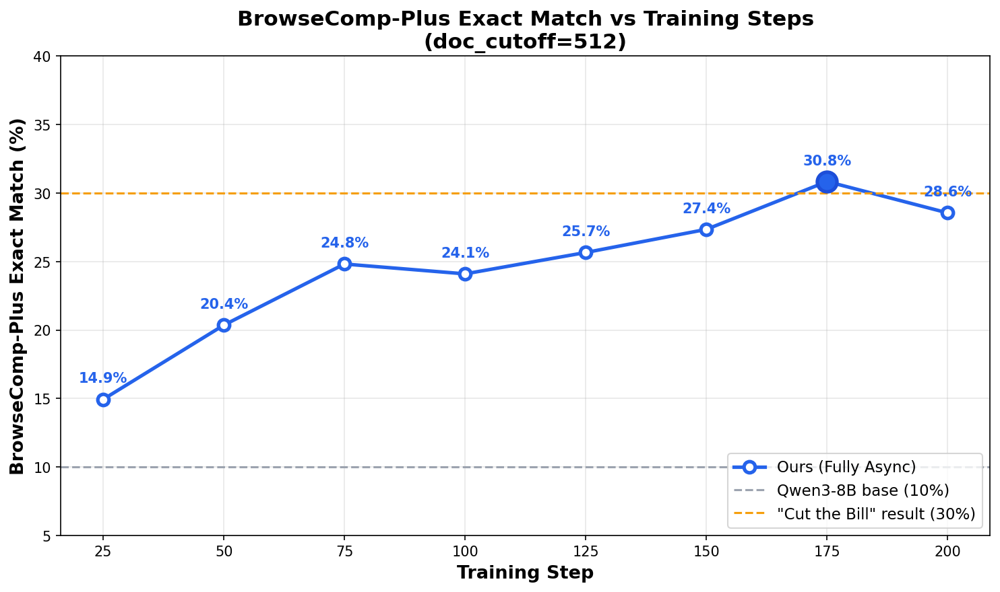

<aside>

**TL;DR**

We achieve **5× faster training** (1 day vs 5 days) by eliminating the generation bubble through asynchronous policy training. All code, training curves, and model weights are fully open-sourced.

🤗 [Model](https://huggingface.co/ThWu/qwen3-8b-deepresearch-ckpt175)  |  👨‍💻 [Code](https://github.com/rllm-org/rllm/tree/main/examples/fully_async/deepresearch)  |  📊 [Wandb](https://wandb.ai/tianhaowu/deepresearch)

</aside>

## The Deep Research Agent Challenge

Recently, a team from Tencent demonstrated impressive results in their ["Cut the Bill"](https://agate-slipper-ef0.notion.site/Cut-the-Bill-Keep-the-Turns-Affordable-Multi-Turn-Search-RL-003f78214a4d451fb06f453d084e666c) blog post, where they trained a deep research agent using [rLLM](https://github.com/rllm-org/rllm) that improved Qwen3-8B from 10% to 30% accuracy on the BrowseComp-Plus benchmark. This was a compelling demonstration of RL-trained search agents — but their training required 5 days on two nodes to complete just 300 training steps. We set out to see how much faster we could go.

By adopting rLLM's fully asynchronous training architecture and introducing three key optimizations, we achieve **5× faster training** (1 day vs 5 days) while reaching the same — and ultimately better — performance.

## Our Recipe for Speed

We built on top of veRL's fully async policy trainer with three critical enhancements.

**Fully Async Training.** The original "Cut the Bill" setup uses a synchronous, colocated architecture where generation and training take turns on the same GPUs. We decouple these into separate resource groups: an inference group that generates sequences sample by sample, streaming them into a message queue, and a training group that continuously fetches completed samples and performs gradient updates. Because generation and training overlap entirely, neither side ever sits idle waiting for the other.

**Partial Rollout.** In agentic tasks, generation times follow a heavy-tailed distribution — some queries take 10× longer to solve than others. In a synchronous setup, these stragglers block the entire pipeline. Rather than discarding in-flight generations when it is time to sync model weights, we implement *partial rollout*: we save the state of ongoing generations, broadcast the updated parameters, and resume those generations with the new model. This prevents a handful of slow queries from holding back the rest of the cluster.

**Mini-Batch Size of 1.** On the training side, we reduce the mini-batch size from 4 (as used in "Cut the Bill") to 1. This yields more frequent parameter updates per sample, which leads to faster convergence — allowing us to reach the same performance with roughly 40% fewer gradient steps.

Together, these three changes deliver the full 5× speedup.

## Adopting "Cut the Bill" Best Practices

While we changed the training architecture, we kept the core engineering decisions from "Cut the Bill" that make deep research training stable in the first place.

**Refine Agent Architecture.** Following their design, we use a two-agent system. The main search agent generates reasoning steps, decides on search queries, and calls `local_retrieve_tool(query)` against a Wikipedia index. Rather than feeding the raw retrieved documents directly back into the search agent — which would quickly exhaust the context window with noisy HTML, tables, and rare symbols — we route them through a dedicated refine agent. This auxiliary LLM (running as a separate vLLM server with fixed pretrained weights) receives the top-10 retrieved snippets per query, summarizes them with respect to the current question, and returns condensed, relevant information to the main agent. This compression step is what makes long search horizons feasible: it keeps the context clean and preserves training stability.

**Synthetic Multi-Turn Dataset.** We train on the ASearcher synthetic dataset, which is specifically designed for long-horizon multi-turn search. Following "Cut the Bill's" data filtering pipeline, we remove non-English samples, discard math problems (which are better served by specialized datasets), and apply reject sampling (n=8) to filter out questions that are either too easy or too hard. This leaves us with approximately 14,000 high-quality training samples.

**Offline Retrieval Infrastructure.** To avoid the cost of calling external search APIs during training, we deploy the same offline retrieval setup. For training, a FAISS-GPU-based Wikipedia server handles up to 1,024 concurrent queries with sub-4-second latency. For evaluation, we use the official BrowseComp-Plus corpus with local retrieval.

## A Surprising Discovery: Document Cutoff Optimization

After training was complete, we discovered a simple test-time improvement that requires no retraining at all.

BrowseComp-Plus defaults to a 512-token cutoff per retrieved document, a conservative setting designed to avoid overwhelming the search agent's context. However, in our setup the refine agent — not the search agent — is the one consuming raw documents, and it has a full 40K-token context window. With 10 documents per query at 512 tokens each, we were using only about 5,120 tokens, or 12.8% of the refine agent's capacity. Roughly 35K tokens were going to waste.

By simply increasing the document cutoff from 512 to 2,500 tokens, we allow the refine agent to ingest substantially richer information per document, produce higher-quality summaries, and better utilize its full context window. This one change yields a +6 percentage point improvement (30% → 36% EM) — entirely for free at test time.

## Results

The table below summarizes our training speed improvement. By combining fully async training, partial rollout, and a smaller mini-batch size, we complete the same 300 training steps in 1 day instead of 5.

| Setup | Architecture | Time | Steps | Speedup |
|-------|--------------|------|-------|---------|
| "Cut the Bill" (Tencent) | Synchronous | 5 days | 300 | 1× |
| **Ours** | **Fully Async** | **1 day** | **300** | **5×** |

On the accuracy side, our model matches "Cut the Bill" at the default 512-token document cutoff, and surpasses it with the optimized 2,500-token cutoff — all while using 5× less wall-clock time.

| Model | BrowseComp-Plus EM | Configuration |
|-------|-------------------|---------------|
| Qwen3-8B (base) | 10% | — |
| "Cut the Bill" result | 30% | doc_cutoff=512 |
| **Ours (default)** | **30%** | doc_cutoff=512 |
| **Ours (optimized)** | **36%** | **doc_cutoff=2500** |

In short, we match "Cut the Bill's" performance using 5× less compute, and with a simple document cutoff optimization, push accuracy another 6 percentage points higher.

