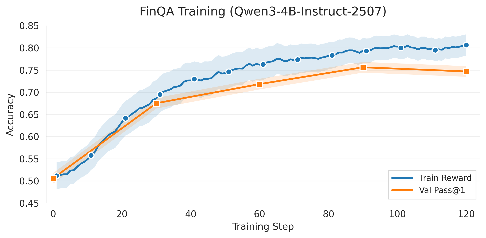

<aside>

## TL;DR
            
In a collaboration between the rLLM team at UC Berkeley and Snorkel AI, we introduce rLLM-FinQA-4B. We demonstrate that a domain specialized 4B model outperforms Qwen3-235B **(59.7% vs 51.4%)** and performs comparably to Gemini 2.5 Pro (60.6%) on Snorkel AI's expert curated agentic financial benchmark.

Our findings suggest that for enterprise AI workloads, procedural reliability often outweighs raw parameter scale. By combining high quality synthetic data with specialized fine tuning for tool use, smaller models can achieve parity with frontier models at a fraction of the cost and latency.
    
👨‍💻 [Github](https://github.com/rllm-org/rllm/tree/main/projects/finqa) | 📊 [Model Weights](https://huggingface.co/rLLM/rLLM-FinQA-4B) | 📖 [Dataset](https://huggingface.co/datasets/rLLM/rLLM-FinQA-Dataset)

</aside>

## From Scaling Parameters to Scaling Expertise

Performing financial analysis requires more than surface level language understanding. It involves multi-step reasoning, executing SQL queries over multiple schemas, and combining retrieved information with numerical calculations to arrive at a final answer.

Using **the rLLM framework**, we fine tuned `Qwen3-4B-Instruct-2507` to be a specialized financial analyst, achieving 59.7% Pass@1 on Snorkel AI's expert curated agentic financial benchmark, outperforming `Qwen3-235B-A22B` **(51.4%)** and performing comparably to Gemini 2.5 Pro (60.6%).

The key to this performance lies in two components:

* A fully synthetic data pipeline that generates high-quality, task-specific training data from raw SEC filings at scale.
* A reinforcement learning (RL) training loop that uses LLM-based judges as reward functions, enabling the model to iteratively improve the reasoning, SQL execution, and numerical calculation skills required for real-world financial analysis.

These results demonstrate that it is possible to train high-performing, domain-specialized models suitable for similar enterprise use cases, without relying on massive general purpose foundation models.

We open-source the synthetic data generation pipeline, training dataset, and training recipe as part of the [rLLM repository](https://github.com/rllm-org/rllm/tree/main/projects/finqa) to support reproducibility and further research.

## The "Terence Tao" Paradox

In the current AI landscape, parameter count is often treated as a proxy for capability. When a model fails at complex analysis, the default reaction is to "scale up"—moving from 8B to 70B or 235B parameters. However, tool-heavy tasks like financial auditing do not necessarily require "polymathic" intelligence.

Consider this: if you need a high-stakes tax audit, hiring a Fields Medalist like Terence Tao is inefficient. While his raw mathematical intelligence is peerless, he likely lacks familiarity with specific accounting software or the rigid schemas of SEC filings. He is a brilliant generalist, but not the most efficient choice for a task requiring a trained specialist.

A 4B model, specifically optimized for financial workflows, functions as that specialist. It lacks the generalist knowledge of a 235B model, but through targeted training, it develops stronger operational discipline. It learns to adhere to strict schemas, respect tool constraints, and follow Standard Operating Procedures (SOPs) without improvising or skipping steps.

## The Discipline Gap

Here's the same question given to the Qwen3-235B generalist and our 4B specialist:

**Question**: "What is the year-over-year growth rate of YouTube ads revenue from 2023 to 2024?"

**Qwen3-235B**:
```python
# Skips table discovery, guesses a table name
sql_query(company_name="youtube", table_name="revenue_breakdown",
    query="SELECT youtube_ads_2023, youtube_ads_2024 FROM revenue_breakdown LIMIT 1")
# ❌ Error: table revenue_breakdown for company youtube could not be found.

# Guesses again instead of calling get_table_names
sql_query(company_name="youtube", table_name="us_gaap_RevenueTable",
    query="SELECT * FROM us_gaap_RevenueTable WHERE segment = 'YouTube'")
# ❌ Error: table us_gaap_RevenueTable for company youtube could not be found.

# Hallucination: Fabricates a growth rate (Actual is ~14.7%)
# "YouTube ads revenue grew approximately 20-25% year-over-year in 2024..."
```

**rLLM-FinQA-4B**:
```python
# Step 1: Discover available tables
get_table_names(company_name="youtube")
> ["us_gaap_DisaggregationOfRevenueTableTextBlock",
   "us_gaap_ScheduleOfEarningsPerShareBasicAndDilutedTableTextBlock",
   ... 25 more tables]

# Step 2: Inspect the revenue table schema
get_table_info(company_name="youtube",
    table_name="us_gaap_DisaggregationOfRevenueTableTextBlock")
> {"column_names": ["revenue_type", "2022", "2023", "2024"],
   "index": {"values": ["google search & other", "youtube ads",
                         "google cloud", "total revenues", ...]}}

# Step 3: Query — gets column name wrong (years are columns, not row values)
sql_query(company_name="youtube",
    table_name="us_gaap_DisaggregationOfRevenueTableTextBlock",
    query="SELECT revenue FROM ... WHERE revenue_type = 'youtube ads' AND year = '2024'")
# ❌ Error : Column not found in table. Available columns are: revenue_type, 2022, 2023, 2024

# Step 4: Self-Correction — catches schema error and retries
sql_query(company_name="youtube",
    table_name="us_gaap_DisaggregationOfRevenueTableTextBlock",
    query='SELECT "2023", "2024" FROM ... WHERE revenue_type = "youtube ads"')
> [{"2023": "31,510", "2024": "36,147"}]

# Step 5: Calculate growth rate
calculator(expression="(36147 - 31510) / 31510 * 100")
> 14.71

# FINAL ANSWER: 14.7%
```

The 235B model guessed table names twice, got the same error both times, and hallucinated an answer. The 4B model discovered the tables, hit a column error, read the error feedback, and adapted its query to compute the correct answer.

This pattern repeats across our evaluation. Generalist models don't fail because they lack reasoning ability; they fail at **reliable tool use**:

- **Schema Hallucination**: Guessing table and column names instead of discovering them using `get_table_names()` and `get_table_info()` tool calls (`revenue_breakdown` instead of `us_gaap_DisaggregationOfRevenueTableTextBlock`)
- **Context Flooding**: Running `SELECT *` queries that overwhelm context limits
- **No Error Recovery**: Repeating the same failed strategy instead of reading error messages and adapting

Success in this class of tasks depends on precise, repeated tool use rather than open-ended reasoning. Improving performance does not require a more intelligent model.

It requires a more disciplined one.


## The Method: Simple Training, Complex Skills

Our approach has two components: (1) a fully synthetic data pipeline that generates QA pairs from raw SEC filings, and (2) a RL training loop with binary correctness rewards.

### 1. Synthetic Data Pipeline

Manually labeling financial reasoning trajectories is expensive and slow. Instead, we built a fully synthetic pipeline that generates high-quality training data from raw SEC 10-K filings. We scrape XBRL tagged financial tables directly from SEC EDGAR, then process them through three LLM driven stages using `Qwen3-30B-A3B-Instruct-2507` served locally via vLLM:

**Stage 1: Schema Extraction (Tables → Structured Schema)**

Before an analyst can reason, they must understand the data environment. We convert raw SEC 10-K tables into strict JSON schemas using constrained decoding, ensuring the model cannot hallucinate columns that don't exist in the source document.

**Stage 2: QA Generation (Schema → Questions)**

An LLM generates question-answer pairs from the structured tables — questions a financial analyst would ask, targeting diverse analytical patterns such as growth rates, contribution shares, spreads, weighted averages, and more. Each question is grounded in the schema from Stage 1, and the model can explicitly decline to generate a question for tables that are unsuitable, avoiding forced low-quality examples.

**Stage 3: Verification**

LLM-generated QA pairs inevitably contain errors: incorrect answers, malformed queries, or references to non-existent data. To filter these out, every sample must pass three layers of verification: first, a programmatic check that all referenced columns and rows exist in the source table. Then, two LLM verification passes that validate correctness, catch hallucinations, and confirm the math.

These three layers of verification significantly reduce noise compared to single-pass verification, giving the RL training loop cleaner signal to learn from.

#### Dataset Summary

| Dataset | Train | Val | Test | Description |
|---------|-------|-----|------|-------------|
| **Single Table** | 4,030 | 522 | 558 | Queries over individual tables |
| **Multi Table** | 991 | 126 | 131 | Requires 2–5 tables, computing 10–20 metrics |

**Evaluation Benchmarks** (Snorkel AI's FinQA benchmark):
- **FinQA**: 290 samples  
- **FinQA-Reasoning**: 79 samples (harder, multi-table reasoning)

### 2. RL Training Loop

We fine-tune `Qwen3-4B-Instruct-2507` using **GRPO** (Group Relative Policy Optimization) within the rLLM framework.

Unlike standard RLHF where a model optimizes a single static response, each training sample here is a **multi-turn agent trajectory**. The model generates a thought, executes a tool call, observes the actual output, and iterates. This ReAct-style loop continues for up to 20 steps before the model commits to a final answer. GRPO then uses the end-of-trajectory reward to update the policy over the entire sequence of reasoning and tool use.

#### Training Environment

The agent operates in an environment with four specialized tools:

- **`get_table_names`** — Discover available tables for a specific company
- **`get_table_info`** — Inspect table schemas, columns, and sample values
- **`sql_query`** — Execute SQL queries over financial tables
- **`calculator`** — Evaluate mathematical expressions

To maximize training throughput, we preload all ~6,900 financial tables into an **in-memory SQLite database** at startup. This eliminates disk I/O latency, allowing the model to execute thousands of SQL queries per second during training.

#### Reward Design

We use a simple **binary correctness reward**:
- **Reward = 1** if the final answer matches ground truth
- **Reward = 0** otherwise

*We experimented with partial rewards (e.g., rewarding intermediate steps like successful table access), but found that binary rewards consistently outperformed them. The sparse signal forces the model to optimize the entire chain of thought rather than gaming intermediate steps. See [Ablation: Binary vs. Partial Rewards](#finding-2-binary-rewards-outperform-partial-rewards) for details.*

**The LLM Judge**
Correctness is verified by an **LLM judge** (`gpt-5-nano`) rather than string matching. Financial answers often have equivalent but syntactically different formats (e.g., "$14.7M", "14,700,000", "14.7"), making exact string matching prone to false negatives.

**Solving the Latency Bottleneck**
While the in-memory SQL execution is instant, the LLM judge introduces a ~2.5s latency penalty per evaluation. With over **365,000 judge calls** required across the full run, we employed two strategies to keep training time tractable:

1.  **1,024 concurrent environments** generate trajectories and collect rewards in parallel (256 prompts × 8 rollouts = 2,048 trajectories per step), ensuring that thousands of judge calls overlap rather than queue sequentially.
2.  **Caching via [Portkey](https://portkey.ai/):** We route all judge requests through the Portkey AI gateway. Since many rollouts produce identical (question, answer) pairs, we achieve a **~40% cache hit rate**, keeping total judge API costs to just **~$40** for the entire run.

#### Training Dynamics



The model shows rapid adaptation in the first 60 steps, with validation accuracy jumping from 50% to 72%. Performance stabilizes after step 60, suggesting the model quickly internalizes the schema constraints and tool definitions.

#### Compute & Cost

| Component | Specification |
| :--- | :--- |
| **Hardware** | 8× H100 (single node) |
| **Wall-Clock Time** | ~21 hours |
| **Compute Cost** | ~<span>$</span>420 (21 hrs × 8 GPUs × <span>$</span>2.50/hr) |
| **Judge API Cost** | ~<span>$</span>40 (via Portkey) |
| **Total Cost** | **<<span>$</span>500** |

*Full training configuration is available in [Training Configuration](#training-configuration).*

## Results

### FinQA: Specialist vs. Generalist

Our central question: can a 4B model, armed with specialized tools and training, compete with a model 60x its size?

The answer is yes. We evaluate all models on Snorkel AI's expert-curated FinQA benchmark (290 samples), which tests agentic financial analysis over real SEC filings.

| Model | Size | Pass@1 |
| :--- | :--- | :--- |
| Qwen3-4B-Instruct-2507 (Base) | 4B | 27.9% |
| gpt-5-nano | — | 50.0% |
| Qwen3-235B-A22B | 235B | 51.4% |
| **rLLM-FinQA-4B (Ours)** | **4B** | **59.7%** |
| Gemini 2.5 Pro | — | 60.6% |
| GPT-4.1 | — | 62.7% |
| o3-mini | — | 63.8% |

**rLLM-FinQA-4B** more than doubles the base model's accuracy (59.7% vs 27.9%), outperforms `Qwen3-235B-A22B` (51.4%), and performs comparably to Gemini 2.5 Pro (60.6%) — despite being a fraction of the size. Scaling parameters alone cannot match the advantage that specialized training creates on structured, tool-heavy tasks.

### FinQA-Reasoning: Domain Generalization

A natural concern is whether these performance gains transfer to harder problems. We evaluate on Snorkel AI's expert-curated **FinQA-Reasoning** benchmark (79 samples), which tests the same class of financial analysis but requires multi-step joins across multiple tables. Critically, our model was trained exclusively on single-table queries.

| Model | Size | Pass@1 |
| :--- | :--- | :--- |
| Qwen3-4B-Instruct-2507 (Base) | 4B | 13.9% |
| Qwen3-235B-A22B | 235B | 18.9% |
| **rLLM-FinQA-4B (Ours)** | **4B** | **26.6%** |
| gpt-5-nano | — | 26.6% |
| o3-mini | — | 30.4% |
| Gemini 2.5 Pro | — | 34.6% |
| GPT-4.1 | — | 37.9% |

The base 4B model performs poorly on multi-table reasoning (13.9%). Our fine-tuned model nearly doubles that to 26.6%, surpassing Qwen3-235B and matching gpt-5-nano. The tool-use discipline learned on simple, single-table queries generalizes directly — no explicit training on multi-table examples was needed. We investigate why in [Finding 1: Simple Data Teaches Complex Skills](#finding-1-simple-data-teaches-complex-skills).

### BFCL: General Tool-Calling Capability

Domain specialization is only valuable if it doesn't come at the cost of general capability. To verify this, we evaluate on the [Berkeley Function Calling Leaderboard (BFCL)](https://gorilla.cs.berkeley.edu/leaderboard.html), a widely used benchmark for general-purpose tool calling across diverse domains.

| Category | rLLM-FinQA-4B | Qwen3-4B-Instruct-2507 (Base) |
| :--- | :--- | :--- |
| **Overall Acc** | **35.65%** | **35.02%** |
| Non-Live AST | 86.67% | 87.90% |
| Live Acc | 75.65% | 76.46% |
| Multi Turn | 21.75% | 20.88% |
| Memory | 23.66% | 19.14% |

Overall accuracy is computed across all BFCL categories; we highlight a small subset above. Our fine-tuned model shows a slight improvement over the base model (35.65% vs 35.02%), with minor gains on Multi Turn (+0.87%) and Memory (+4.52%). Specialization for financial analysis did not erode the model's broader tool-use competence.

## Ablation Studies: Less is More
We ran ablations to isolate *what* drove this performance. The results challenged two common assumptions in LLM training.

*All ablations are evaluated on our internal validation set. These numbers are intended for relative comparison between configurations and should not be directly compared to the Snorkel FinQA benchmark results above.*

### Finding 1: Simple Data Teaches Complex Skills

We assumed that to solve multi-table reasoning tasks, we needed to train on expensive, complex multi-table examples.

| Training Data | Internal Pass@1 |
| :--- | :--- |
| **Single Table Only** | **66.3%** |
| Single + Multi-Table | 61.6% |
| Curriculum (Single → Multi) | 64.8% |

The single-table-only configuration outperformed both alternatives. Adding multi-table data introduced noise and increased training time without improving the core skill. Even curriculum learning — starting simple and gradually increasing complexity — offered no significant gain over the simpler approach.

This explains the generalization result from [FinQA-Reasoning](#finqa-reasoning-domain-generalization). The bottleneck was never reasoning depth — it was tool-use reliability. Once the model mastered the fundamentals of schema discovery, SQL syntax, and error recovery via simple single-table examples, it could compose those skills into complex multi-step joins without explicit training.

### Finding 2: Binary Rewards Outperform Partial Rewards

A natural question is whether more informative reward signals — rewarding intermediate steps like successful table access or query completeness — could accelerate learning over the simple binary correctness reward described above.

| Reward Structure | Training Data | Pass@1 |
| :--- | :--- | :--- |
| **Binary Correctness** | Single Table | **66.3%** |
| Partial (0.2 × table_access + 0.8 × correctness) | Single Table | 54.0% |
| Binary + Multi-Table Rubric | Single + Multi Table | 61.6% |
| Binary + Curriculum (Single → Multi) | Single + Multi Table | 64.8% |

The most sophisticated variant — the multi-table rubric — used a fine-grained scoring function with six weighted components:

| Component | Weight | Description |
| :--- | :--- | :--- |
| Primary Data Score | 0.30 | Core data retrieval correctness |
| Derived Metrics Score | 0.30 | Calculated metrics correctness |
| Reasoning Score | 0.15 | Quality of reasoning steps |
| Consistency Score | 0.10 | Internal consistency across queries |
| Completeness Score | 0.10 | Coverage of required information |
| Structure Score | 0.05 | Output format adherence |

Despite this investment in reward engineering, all partial reward variants underperformed the simplest possible reward: a single binary signal.

To understand why, we analyzed the failure modes of the base model:

| Failure Mode | Frequency |
| :--- | :--- |
| Wrong Table Accessed | ~27% |
| SQL Error / Calculation Error | ~62% |
| Other | ~11% |

The base model was already competent at finding the right table (~73% success). By explicitly rewarding intermediate steps like table access, we incentivized the model to "game" the easier parts of the task, distracting it from the harder problems.

The sparse binary signal forced the model to optimize the *entire* trajectory.

## Conclusion: The Blueprint for the Enterprise Agent

rLLM-FinQA-4B is a case study in efficiency over scale. For the enterprise, the goal is not to build a model that can write poetry and solve IMO math problems — it is to build a specialist that handles proprietary data reliably.

The deployment economics reinforce this. A 4B model runs on a single GPU, whereas a 235B model requires a multi-node cluster. For organizations processing thousands of analyst queries daily, this specialized approach offers an order-of-magnitude reduction in cost while improving accuracy and ensuring full data sovereignty.

Critically, this methodology extends beyond finance. In healthcare, law, and insurance—anywhere structured data and tool use intersect—the same blueprint applies: convert documents into queryable structures, teach tool-calling fundamentals on simple tasks, verify aggressively, and fine-tune.

The next wave of AI productivity will not come from larger clusters, but from smaller, agentic specialists — trained efficiently, deployed privately, and optimized for the task at hand.

## Contributors

This work is a joint collaboration between the rLLM team and the Snorkel AI team. Contributors include **Manan Roongta** and **Sijun Tan** from the rLLM team, and **Bhavishya Pohani**, **Charles Dickens**, and **Christopher Glaze** from the Snorkel AI team.

The rLLM project is advised by **Chenguang Wang**, **Li Erran Li**, **Raluca Ada Popa**, and **Ion Stoica**.

## Training Configuration

### Model & Algorithm

| Parameter | Value |
|-----------|-------|
| Base Model | `Qwen3-4B-Instruct-2507` |
| Algorithm | GRPO (Group Relative Policy Optimization) |
| Framework | rLLM |

### Core Hyperparameters

| Parameter | Value | Description |
|-----------|-------|-------------|
| Learning Rate | `1e-6` | Actor optimizer LR |
| Train Batch Size | 256 | Prompts per batch |
| Rollouts per Prompt (n) | 8 | Trajectories sampled per question |
| Mini-Batch Size | 32 | Gradient update batch size |
| Clip Ratio | 0.28 | Clipping threshold |
| Entropy Coefficient | 0.002 | Exploration bonus |
| KL Coefficient | 0.001 | KL penalty weight |
| Total Epochs | 10 | Full passes over training data |

### Context & Generation

| Parameter | Value |
|-----------|-------|
| Max Prompt Length | 2,048 tokens |
| Max Response Length | 16,384 tokens |
| Max Agent Steps | 20 |
| Temperature (train) | 0.7 |
| Temperature (val) | 0.6 |
| Top-p (val) | 0.95 |

### Training Scale

| Metric | Value |
|--------|-------|
| Total Training Steps | 120 |
| Training Samples | 4,030 (single-table) |
| Effective Trajectories | ~245,760 |
| Wall-Clock Time | ~21 hours |

### Compute Resources

| Component | Specification |
|-----------|---------------|
| GPUs | 8× H100 (single node) |
| Training Strategy | FSDP2 with optimizer offload |
| Gradient Checkpointing | Enabled |
| Prefix Caching | Enabled |
| Parallel Rollout Workers | 1,024 |

### Checkpointing & Evaluation

| Parameter | Value |
|-----------|-------|
| Save Frequency | Every 10 steps |
| Validation Frequency | Every 10 steps |
| Validation Rollouts (n) | 8 |


### Cost Breakdown

| Component | Cost |
|-----------|------|
| GPU Compute (8× H100 × 21 hrs @ <span>$</span>2.50/hr) | ~<span>$</span>420 |
| Judge API Calls (gpt-5-nano) | ~<span>$</span>40 |
| **Total** | **<<span>$</span>500** |

