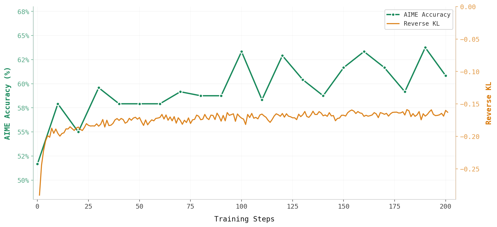

<aside>

**TL;DR**

rLLM's [unified trainer](https://x.com/rllm_project/status/2029289280062013452) now supports on-policy distillation (OPD) out of the box through workflow-level precomputed advantages, making it much easier to integrate new training algorithms without modifying the trainer core.

As a concrete example, we reproduce the setup from the [Tinker's blogpost on OPD](https://thinkingmachines.ai/blog/on-policy-distillation/): using Qwen3-32B as the teacher and Qwen3-8B-Base as the student, we improve AIME 2024 accuracy from 51% to 63% in 100 training steps.

👨‍💻 [Code](https://github.com/rllm-org/rllm/tree/main/examples/math_distill) | 📊 [WandB](https://wandb.ai/kylemontgomery/rllm-opd/runs/5goonudj)
    
</aside>

## The Problem: Sparse vs Dense Feedback

Post-training approaches fall into two categories:

| Method | Sampling | Feedback |
|--------|----------|----------|
| Reinforcement Learning | On-policy | Sparse (1 bit per episode) |
| Supervised Fine-tuning | Off-policy | Dense (per-token) |
| **On-Policy Distillation** | **On-policy** | **Dense (per-token)** |

**RL** trains on the student's own outputs, but provides sparse feedback. The model only learns "correct" or "incorrect" at the end, not *where* it went wrong.

**SFT** provides dense supervision by training on teacher trajectories, but suffers from exposure bias, meaning the student learns in states the teacher visits but not states it will find itself in during inference.

## On-Policy Distillation: Best of Both Worlds

On-policy distillation solves this by:
1. **Sampling trajectories from the student** (on-policy)
2. **Grading each token using the teacher's log probabilities** (dense feedback)

The core idea is to compute a **per-token unbiased estimator of the reverse KL** on student-sampled trajectories:

```
advantage[t] = log π_teacher(x_t | x_1..t-1) - log π_student(x_t | x_1..t-1)
```

Tokens where the student diverges from the teacher receive higher penalties, pushing the student to match the teacher's distribution in states it actually visits.

## Our Implementation

rLLM's **unified trainer** supports a general precomputed-advantage pattern: a workflow can assign per-token training signals directly to `step.advantage`, and with `rllm.algorithm.use_precomputed_advantage=true`, the trainer consumes those values instead of computing advantages later from grouped trajectory rewards. This pattern is described in the earlier unified trainer post and rLLM's [precomputed advantage documentation](https://rllm-project.readthedocs.io/en/latest/experimental/rllm-precompute-advantage/). OPD is then a concrete example of this abstraction, where the workflow precomputes reverse-KL-style token-level signals from teacher and student log probabilities.

### The Distillation Workflow

The `DistillationWorkflow` generates a response from the student, then computes per-token distillation advantages by querying the teacher:

```python
# imports omitted for brevity
from rllm.agents.agent import Step
from rllm.trainer.distill import compute_step_distill_advantage

class DistillationWorkflow(Workflow):
    async def run(self, task: dict, uid: str, **kwargs) -> Episode:
        # ... setup code omitted ...
        messages = [{"role": "user", "content": task.get("question")}]

        # Sample a trajectory from the student
        output = await self.rollout_engine.get_model_response(messages, application_id=uid, **kwargs)

        # Convert model output into a Step without manual field plumbing
        step = Step.from_model_output(output, messages=messages)
        step.reward = self.reward_function(task, output.content).reward

        # Precompute per-token OPD advantages inside the workflow
        step.advantage = await compute_step_distill_advantage(
            step=step,
            teacher_engine=self.teacher_engine,
            student_tokenizer=self.rollout_engine.tokenizer,
            teacher_tokenizer=self.teacher_engine.tokenizer,
            shared_tokenizer=self.shared_tokenizer,
            teacher_chat_parser=self.teacher_engine.chat_parser,
            clip_min=self.clip_min,
            clip_max=self.clip_max,
        )

        self.trajectory.steps.append(step)
        return self.collect_trajectories()
```

### Computing Distillation Advantages

The `compute_step_distill_advantage` function handles the core OPD logic:

1. Query the teacher model for log probabilities on the student's generated tokens
2. Compute per-token advantage: `teacher_logprob - student_logprob`
3. Optional token-level advantage clipping to prevent instability

Also, we have added experimental support for distilling across tokenizers, such as Kimi-K2.5 as the teacher and Qwen3-8B as the student. To do so, we align the student and teacher tokens at the byte level, and split/merge teacher logprobs across the overlapping student tokens.

## Running the Example

### 1. Prepare the Dataset

We use [DeepMath-103K](https://huggingface.co/datasets/zwhe99/DeepMath-103K) for training and [AIME 2024](https://huggingface.co/datasets/HuggingFaceH4/aime_2024) for evaluation:

```python
# examples/math_distill/prepare_deepmath_data.py

from datasets import load_dataset
from rllm.data.dataset import DatasetRegistry

def prepare_deepmath_data():
    train_dataset = load_dataset("zwhe99/DeepMath-103K", split="train")
    test_dataset = load_dataset("HuggingFaceH4/aime_2024", split="train")

    def preprocess_train(example, idx):
        return {
            "idx": idx,
            "question": example["question"],
            "ground_truth": str(example.get("answer", "")),
            "data_source": "deepmath",
        }

    def preprocess_test(example, idx):
        return {
            "idx": idx,
            "question": example["problem"],
            "ground_truth": str(example["answer"]),
            "data_source": "aime2024",
        }

    train_dataset = train_dataset.map(preprocess_train, with_indices=True)
    test_dataset = test_dataset.map(preprocess_test, with_indices=True)

    DatasetRegistry.register_dataset("deepmath_opd", train_dataset, "train")
    DatasetRegistry.register_dataset("deepmath_opd", test_dataset, "test")
```

### 2. Training Script

The main point is that OPD plugs into the same `(experimental) AgentTrainer` entrypoint as regular RL. There is no separate trainer for distillation: you keep the unified trainer, swap in a workflow that precomputes `step.advantage`, and pass the teacher engine through `workflow_args`.

```python
# imports omitted for brevity
from rllm.experimental.unified_trainer import AgentTrainer

# ... teacher_engine setup omitted ...

trainer = AgentTrainer(
    workflow_class=DistillationWorkflow,
    workflow_args={
        "reward_function": math_reward_fn,
        "teacher_engine": teacher_engine,
        "shared_tokenizer": True,
        "clip_min": -5.0,
        "clip_max": 5.0,
    },
    config=config,
    train_dataset=train_dataset,
    val_dataset=test_dataset,
    backend="tinker",
)

trainer.train()
```

Full training script: [`examples/math_distill/train_deepmath_distill_tinker.py`](https://github.com/rllm-org/rllm/blob/main/examples/math_distill/train_deepmath_distill_tinker.py)

### 3. Launch Training

```bash
set -x

python -m examples.math_distill.train_deepmath_distill_tinker \
    rllm/backend=tinker \
    training.resume_from_tinker_id='tinker://4a1939e6-04be-5a77-9e4e-910ccff9f27e:train:0/weights/final' \
    model.name=Qwen/Qwen3-8B-Base \
    model.lora_rank=128 \
    training.group_size=4 \
    validation.group_size=8 \
    training.learning_rate=1e-4 \
    sampling.train.temperature=1.0 \
    sampling.val.temperature=1.0 \
    data.max_prompt_length=2048 \
    data.max_response_length=4096 \
    +sampling.val.max_tokens=32768 \
    data.train_batch_size=128 \
    data.val_batch_size=512 \
    rllm.trainer.total_epochs=1 \
    rllm.trainer.logger=['console','wandb'] \
    rllm.trainer.project_name='opd-deepmath-8b-32b' \
    rllm.trainer.experiment_name='deepmath-distill-8b-32b-unified' \
    rllm.trainer.val_before_train=True \
    rllm.trainer.test_freq=10 \
    rllm.trainer.save_freq=10 \
    training.default_local_dir='./outputs/deepmath-distill-8b-32b-unified' \
    rllm.algorithm.use_precomputed_advantage=true \
    rllm.algorithm.loss_fn=importance_sampling \
    rollout_engine.bypass_render_with_parser=False \
    rollout_engine.renderer_name=qwen3 \
    rllm.workflow.n_parallel_tasks=512
```

Key configuration flags:
- `use_precomputed_advantage=true` — tells the unified trainer to use the workflow's pre-computed advantages
- `loss_fn=importance_sampling` — uses importance sampling loss for the policy gradient update
- `clip_min=-5.0, clip_max=5.0` — clips per-token advantages to prevent instability

## Results
The table below summarizes our main findings:



Starting from an SFT checkpoint of Qwen3-8B-Base, we train for 200 steps with OPD. After just 100 steps, accuracy on AIME 2024 improves from 51% to 63%. Meanwhile, the reverse KL converges just under -0.15. 
