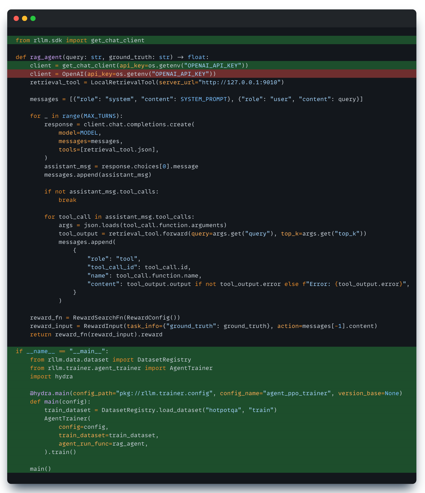

## TL;DR

Agent engineers and RL researchers speak different languages. Agent engineers build with **API calls**—frameworks like LangGraph, AutoGen, and Claude SDK are just sophisticated wrappers around `client.chat.completions.create()`. RL training, however, requires **token-level data**: token IDs, log probabilities, and trajectories.

**rLLM SDK** bridges this gap. Our mission is to **democratize RL training**. We intercept your API calls, capture the exact token IDs directly from the inference server, and translate everything into training-ready data—automatically. **Minimal code changes. No retokenization. What you build is what you train.**

---

## The Great Divide: Two Languages, One Goal

### The Language Gap: API vs. Tokens

At its core, agent development is **built on top of making API calls**. Whether you use **LangGraph**, **AutoGen**, or **Claude SDK**, you are ultimately sending messages and receiving completions via `client.chat.completions.create()`. These frameworks add powerful scaffolding—state management, branching logic, and tool orchestration—but they all speak the language of APIs.

**RL training**, however, speaks a completely different language: **Tokens**. It requires numerical token IDs (`[1, 234, 567]`), log probabilities, and trajectories. These two languages describe the same thing—an LLM generating a response—but in fundamentally incompatible formats.

### The Traditional Bridge: A Broken Translation

Historically, bridging this gap meant manually translating from API-land to Token-land. You had to **rewrite your agent** into a rigid training loop and **re-tokenize** the text outputs. This "Inference-Train Gap" is painful and dangerous:

1.  **Duplicated Code**: You maintain two versions of your agent—one for production (framework) and one for training (loop). Subtle logic differences mean you aren't training the agent you deploy.
2.  **Retokenization Mismatch**: Tokenizers are context-sensitive, so re-tokenizing generated text often yields different token sequences than what the model actually produced (e.g., `" Pantom"` can be `[53122, 316]` or `[393, 30002]`). This forces the model to train on "off-policy" data it never generated, leading to reward collapse.

---

## Our Solution: Democratizing RL for Agent Builders

We built rLLM SDK with a clear motivation: to **democratize Reinforcement Learning** for the engineering community. We believe that training shouldn't be the privilege of specialized research teams. If you can build an agent, you should be able to train it.

Since all agent frameworks are built on top of making API calls, we intercept at that layer and handle the translation to training data automatically.

### System Architecture

The architecture consists of three main components working in unison:

1.  **Agent Engine (Your World)**: This is where your code lives. Whether it's a simple Python script or a complex LangGraph workflow, it communicates via standard API calls. The Agent Engine will handle parallelization or asynchronous execution to run your code efficiently.
2.  **SDK Translation Layer (The Bridge)**: This is the core of rLLM SDK.
    *   **LiteLLM Proxy**: Intercepts your API calls and routes them to the inference engine during training. Crucially, it captures the **exact token IDs** and optional **log probabilities** generated by the model.
    *   **SQLite Store**: Acts as the persistent memory, storing these tokens along with log probabilities and metadata. This effectively provides a single source of truth for training.
3.  **Agent Trainer (RL World)**: The training engine (built on VERL) fetches LLM Calls from the store and transforms them into trajectories ready for training. Using the exact tokens captured from vLLM ensure the gradient update is on policy.

This means you can use **any framework** (LangGraph, AutoGen, etc.) with **minimal changes** — just swap the client — and guarantee **exact parity** between training and inference.

---

## Tutorials

We provide hands-on tutorials that progressively introduce more complex agent patterns:

| Tutorial | Complexity | What You'll Learn |
|----------|------------|-------------------|
| **[Simple Math Agent](https://rllm-project.readthedocs.io/en/latest/examples/sdk_math/)** | Beginner | Basic `get_chat_client()`, single-step rollouts, trainer setup |
| **[Solver-Judge Workflow](https://rllm-project.readthedocs.io/en/latest/examples/sdk_solver_judge/)** | Intermediate | `@trajectory` decorator, multi-agent composition, per-step rewards |
| **[LangGraph RAG Agent](https://rllm-project.readthedocs.io/en/latest/examples/sdk_langgraph_rag/)** | Advanced | LangChain integration, multi-turn tracing, tool-using agents |

---

## References

- [Retokenization issues in RL training](https://wandb.ai/tianhaowu/rllm-agent/reports/Tokenization-Mismatch-in-Text-Level-Operations--VmlldzoxNDg0MTcwMw)
- [VERL: Distributed RL Training](https://github.com/volcengine/verl)
- [LiteLLM Proxy](https://docs.litellm.ai/docs/proxy/quick_start)
