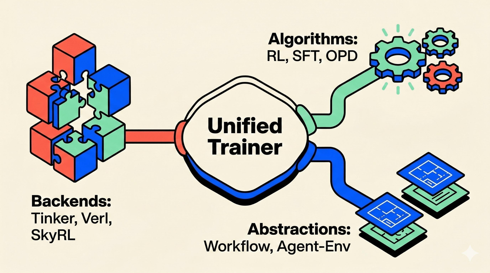
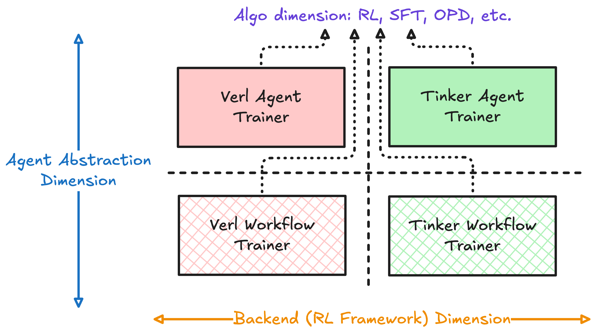
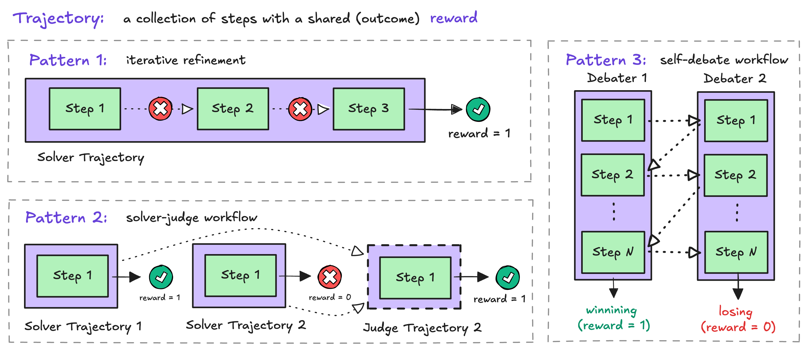
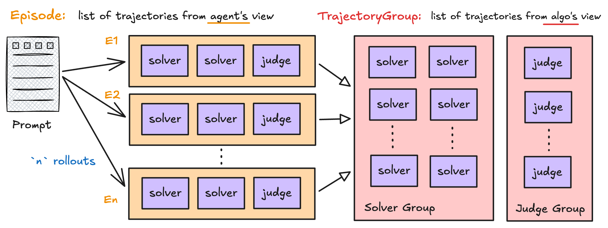

## TL;DR

In the latest release of `rLLM`, we’re introducing **`UnifiedTrainer`** — a single, standardized post-training pipeline for LLM agents that works across multiple **backends** (`Verl`, `Tinker`, and `SkyRL`) and multiple **algorithms** (SFT, RL, on-policy distillation, and more).

* **If you’re an RL algorithm researcher:** you can make a new RL/RLVR-style method available across different training frameworks with minimal migration work.
* **If you’re building agent infrastructure:** you can integrate your own trainer into the `rLLM` ecosystem by implementing a small, standard **backend protocol** — gaining access to existing workflows, examples, and agent harnesses “for free.”

Starting with **`rLLM v0.3`**, `UnifiedTrainer` becomes the default way to train workflow-based agents with `Tinker`. We’ll also migrate and deprecate the legacy trainers (including `Verl`-specific trainers and the older `agent-env`-based trainers) in favor of `UnifiedTrainer` over the next iterations.

---

## 0. Background: the “dimensions” of an agent trainer

`rLLM`’s goal is to **democratize LLM agent post-training**: you should be able to train *arbitrary agentic programs* using *arbitrary post-training methods*. Over time, that pushed `rLLM` toward an **orchestration layer**.

Instead of building and maintaining our own inference / training infrastructure, we delegate low-level primitives — episode generation, parameter updates, weight syncing, etc. — to **training backends** (e.g., `Verl`, `Tinker`). `rLLM` focuses on what it does best: introducing [new abstractions](https://rllm-project.com/post.html?post=rllm_v0.2.md) for expressing trainable agent programs, adding support for new post-training algorithms, and integrating new backends.

Over the past few months, we’ve expanded along several independent “dimensions”:

* **Agent abstraction:** the classic `agent-env` interface and the newer *workflow* abstraction
* **Training backend:** `Verl`, `Tinker`, and (incoming) `SkyRL`
* **Algorithm:** RLVR, SFT, and on-policy distillation (OPD)
* **Other (omitted below):** SDK support, fully async rollout patterns

This breadth is great for coverage, but the old architecture effectively required a **separate trainer per combination** of these dimensions. That quickly becomes painful: it increases maintenance burden for developers and makes it harder for users to choose a trainer — or switch when their backend/abstraction/algorithm changes.

`UnifiedTrainer` is our step-by-step solution to that problem. Below, we’ll walk through:

1. The standardized `UnifiedTrainer` post-training pipeline designed to cover the combinations above.
2. How `BackendProtocol` makes integrating a backend easy — and removes the need for backend-specific trainers.
3. How the refreshed `rLLM` data format (plus a set of default protocols) makes it easier to orchestrate complex training algorithms for multi-agent workflows.
4. What’s next: where `rLLM` is heading, and what to expect in upcoming releases.

## 1. A unified post-training pipeline

The core insight behind `UnifiedTrainer` is simple:

> The *structure* of agent post-training is largely the same — even when the backend, algorithm, or agent abstraction changes.

More concretely, no matter whether you're doing RLVR on `Verl` or OPD on `Tinker`, a very high-level training loop always hold:

1. Run agents to generate trajectories (or episodes with multiple rollouts in multi-agent settings), or you obtain them directly from a dataset in SFT cases.
2. Transform those trajectories into something trainable (with optional filtering and re-grouping, e.g. forming groups for GRPO) -- in the end, each token receives its advantage or loss inputs for gradient update.
3. Perform a learning update. Sync the updated model (LoRA or full parameters) for future rollouts.
4. Log, validate, and repeat.

The differences lie in *how* the advantages/loss-inputs are computed, *where* inference runs, and *how* parameters are synced — not in the outer orchestration.

`UnifiedTrainer` codifies this observation. It standardizes the post-training loop once, and treats backend-specific training system as a **pluggable component** inside that loop. One of the most important architectural shifts is that `UnifiedTrainer` does **not** directly manipulate models -- e.g. implement the model sharding strategies, compute forward/backward passes, or even validate the configurations. Instead, the trainer focuses on what is *backend-invariant*, such as:

* coordinating workflow execution,
* organizing trajectory-level transformations,
* handling (potential) rejection sampling and filtering,
* consolidating and logging various metrics (sent back from the backend).

With this separation of concerns, `UnifiedTrainer` comes in at ~450 lines of code, compared with 900+ lines for the standalone `Verl` workflow trainer — and the training loop is much more readable and stable. This design also makes experimentation easier: if you're working on a new RL variant, you can focus on the algorithm implementation without rewriting rollout orchestration for every infrastructure stack.

For more details on the `UnifiedTrainer` design, check out the [documentation](https://rllm-project.readthedocs.io/en/latest/experimental/unified-trainer/).

## 2. BackendProtocol: pluggable training primitive implementations

As `UnifiedTrainer` manages a stable outer loop, `BackendProtocol` is the contract that enables the plugin of any training stack.

A backend is responsible for everything that depends on *how* training happens (under the hood in the eyes of `UnifiedTrainer`), including

* how inference/rollout is carried out (local GPUs? remote service?),
* how batches are represented internally (transformed from `rLLM`-native data structures),
* how forward/backward passes are computed,
* how optimizer updates are applied,
* how checkpoints are saved and synced.

More specifically, the `BackendProtocol` defines a set of standard yet flexible **functions** that every training backend will implement -- these functions can be characterized into two categories:
1. **Training pipeline methods** such as `generate_episodes()`, `compute_advantages()`, and `process_backend_batch()` -- these methods will be orchestrated and called by the `UnifiedTrainer` in the standard training loop mentioned above.
2. **Lifecycle hooks** such as `on_train_start/end()` and `on_batch_start/end()`. These methods provide additional flexibilities to work around certain backend-specific "edge cases" (e.g. perform some cleanups after each batch).

One subtle design choice here is that the protocol is intentionally **structured but not rigid**. The trainer calls a few backend “stages” in a fixed order, but the backend is free to redistribute work across them. A nice example is a *fused mode* implemented in the `TinkerBackend`: where the backend interleaves the optimizer step with the forward-backward (as this is explicitly encouraged by [`Tinker`](https://tinker-docs.thinkingmachines.ai/async#performance-tips-overlap-requests)). Under this mode, the `update_policy()` function is doing nothing, as the backend implementation freely "promotes" this step within the `process_backward_batch()` stage.

## 3. Supporting flexible training algorithms

Next we will talk about some new features that attempt to **unify the algorithm dimension** under the new `UnifiedTrainer`. To make supporting *any algorithm* realistic (especially for multi-agent workflows), two elements are needed from a framework like `rLLM`:

1. a data format that cleanly separates *rollout-time structure* from *algorithm-time structure* in terms of organizing the agent trajectories, and
2. a way to flexibly "assign different training algorithms" to different parts of a rollout (i.e. different trajectories in an episode are trained differently)

The first element has been addressed since in `v0.2` via a hierarichal, `rLLM`-native data format design

### 3.1 Recap: Step, Trajectory, Episode, and TrajectoryGroup

In rLLM, the internal data progression is:

**Step → Trajectory → (Episode / TrajectoryGroup).**

A **Step** is the atomic training-relevant record: it captures the prompt tokens, response tokens, and token-level logprobs for one model interaction. At runtime it may also carry extra execution context (messages, tool actions, environment observations), but the important part is: it’s the unit that ultimately receives token-level training signals.

A **Trajectory** is a sequence of steps from a *single role* (solver, judge, runner, etc.). In the common “broadcast” style of RLVR training, all steps in a trajectory **share the same outcome signal**: you store a trajectory-level reward, and the same trajectory-level advantage is applied to every step in that trajectory.

An **Episode** is what a workflow returns for *one rollout*: it groups trajectories across different roles produced in that execution. This is the natural unit for workflow authors — “what happened when I ran the workflow once.”

However, most RL algorithms do not operate directly on episodes. Instead, they require **comparison sets**. For example:

* “All solver trajectories for the same prompt across N rollouts” (GRPO-style training)
* “All judge trajectories for the same prompt”

To support this view, rLLM introduces **TrajectoryGroup**, an algorithm-facing abstraction. By default, trajectories are grouped using `(task_id, trajectory.name)`, along with additional sanity checks to ensure consistent grouping.

This separation allows workflow authors to focus on defining how agents run, while the training pipeline automatically reorganizes rollout data into the structures required by learning algorithms.

In the new version of rLLM, this design enables two important capabilities that significantly expand the range of post-training algorithms we can support.

### 3.2 Role-specific advantage estimators

rLLM provides a growing collection of built-in advantage estimators (e.g., GRPO, REINFORCE, RLOO), and users can easily register their own.

Traditionally, RL training pipelines specify **a single advantage estimator** for all trajectories. This assumption works well for single-agent RL, but quickly becomes limiting in **multi-role workflows**, where different roles often follow very different training semantics.

For example:

* A **solver** role may be sampled multiple times per prompt, naturally forming a comparison set suitable for a group-based estimator such as GRPO.
* A **judge** role, on the other hand, receives inputs that include solver outputs. Simply grouping judges across different episodes may not make sense, and a more direct training objective (e.g., REINFORCE or OPD-style signals) may be preferable.

To support such scenarios, rLLM allows **role-specific advantage estimators**. Conceptually, this is just a mapping: `role_name → advantage_estimator`.

With this mechanism, different roles within the same workflow can be trained with different objectives, while still sharing the same trainer, backend, and rollout pipeline.

For more details about this feature, please check out the [documentation](https://rllm-project.readthedocs.io/en/latest/experimental/rllm-rl-advantage-estimator/).

---

### 3.3 Precomputed per-token step advantages

In some situations, the term *advantage* is better interpreted as a **generic token-level training signal** that can be determined immediately after rollout. In these cases, there is no need to compute advantages later during the `compute_advantage()` phase of the training loop.

Two common examples include:

* **SFT-style supervision**, where token-level targets directly determine the training signal.
* **On-policy distillation**, where reverse-KL–style signals can be computed directly from the teacher and student logprobs once the student rollout finishes.

For these setups, rLLM supports **precomputing advantages during workflow execution** by allowing users to set `step.advantage` directly.

When this field is present, the trainer will consume those values instead of running a standard advantage estimator. This enables true **mixed-mode training** within a single job: some roles can use GRPO/REINFORCE/RLOO-style estimators, while others bypass estimator computation entirely and rely on precomputed per-token signals.

More details about this feature can be found [here](https://rllm-project.readthedocs.io/en/latest/experimental/rllm-precompute-advantage/)

## Moving Forward

With this release — and many exciting updates on the way — we’re evolving rLLM from a post-training framework into a full-stack platform for developing, evaluating, and continuously improving AI agents.

Here’s what’s coming next:

- rLLM UI for monitoring agent evaluation and training in real time.
- Seamless SDK integrations with popular agent frameworks.
- rllm CLI for launching evaluation and training runs from the command line.

This is just the beginning. Stay tuned for the next wave of updates!
